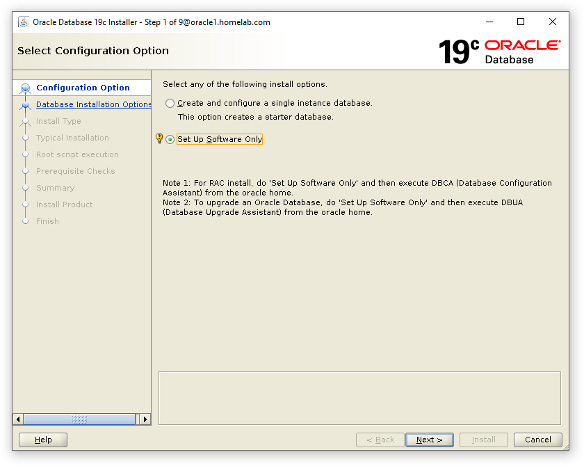
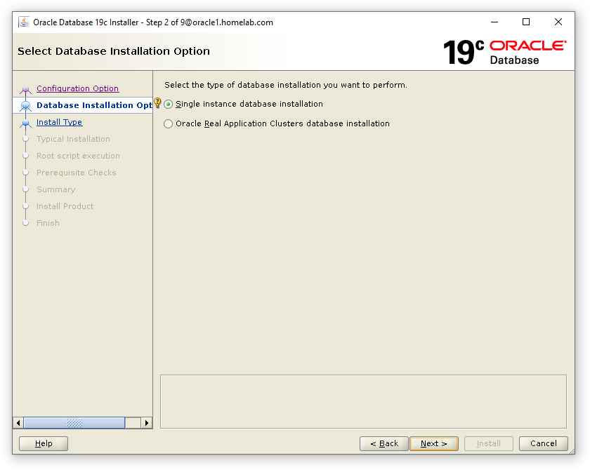
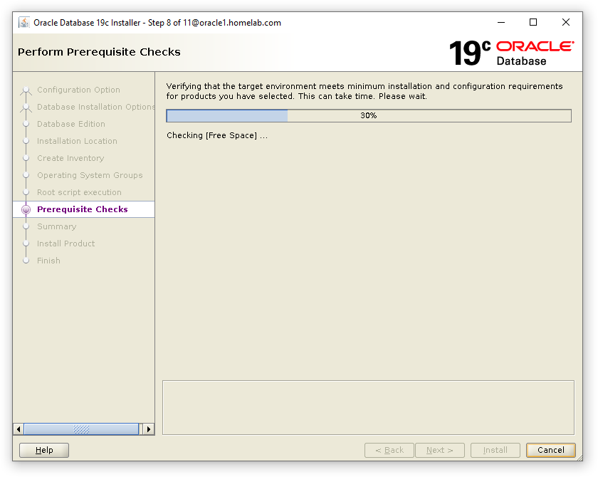


#### A step-by-step process to installing Oracle 19c Software for Single Instance Database on Red Hat Enterprise Linux 7.9





**Note:** This Guide is Production Ready.



## Prerequisites 

### Install required X11 packages
Install X11 packages with following command based on your operating system release and version:

```bash
yum install xorg-x11-xauth -y
```
### Configure X11 forwarding

To enable X11 Forwarding, change the “X11Forwarding” parameter using vi or nano editor to `yes` in the `/etc/ssh/sshd_config` file if either commented out or set to no.

```bash
vi /etc/ssh/sshd_config
```
or 

```bash
nano /etc/ssh/sshd_config
```

You should see similar output as the following:

`X11Forwarding yes`

### Install the Dependencies


<details>

<summary>🛠️Install the Following🛠️</summary>

```bash
yum install libnsl* -y
yum install -y bc    
yum install -y binutils
yum install -y compat-libcap1
yum install -y compat-libstdc++-33
#yum install -y dtrace-modules
#yum install -y dtrace-modules-headers
#yum install -y dtrace-modules-provider-headers
yum install -y dtrace-utils
yum install -y elfutils-libelf
yum install -y elfutils-libelf-devel
yum install -y fontconfig-devel
yum install -y glibc
yum install -y glibc-devel
yum install -y ksh
yum install -y libaio
yum install -y libaio-devel
yum install -y libdtrace-ctf-devel
yum install -y libXrender
yum install -y libXrender-devel
yum install -y libX11
yum install -y libXau
yum install -y libXi
yum install -y libXtst
yum install -y libgcc
yum install -y librdmacm-devel
yum install -y libstdc++
yum install -y libstdc++-devel
yum install -y libxcb
yum install -y make
yum install -y net-tools # Clusterware
yum install -y nfs-utils # ACFS
yum install -y python # ACFS
yum install -y python-configshell # ACFS
yum install -y python-rtslib # ACFS
yum install -y python-six # ACFS
yum install -y targetcli # ACFS
yum install -y smartmontools
yum install -y sysstat
```

</details>

```bash
yum update -y
```
``` bash title="To check if Development Tools are installed"
yum grouplist
```

```bash title="If Development tools have not been installed"
yum group install "Development Tools"

```


### Create Oracle Groups and add user
```bash
groupadd -g 3001 oinstall
groupadd -g 3002 dba
groupadd -g 3003 oper
useradd -u 3001 -g oinstall -G dba,oper oracle
```

```bash
passwd oracle
```

### Create the required directories
```bash
mkdir -p /u01/app/oracle/product/19.3/db_home
```

### Change Ownership & Access Permissions
```bash
chown -R oracle:oinstall /u01
chmod -R 775 /u01
```

```bash title="Login with Oracle User"
su - oracle
```

```
export CV_ASSUME_DISTID=RHEL8.5
```

### Update the .bash_profile
```title="Using vi editor"
vi .bash_profile
```
```title="Using vi editor"
nano .bash_profile
```

Update the Bash Profile with the following:
```bash
export ORACLE_BASE=/u01/app/oracle
export ORACLE_HOME=/u01/app/oracle/product/19.3/db_home
export CLIENT_HOME=/u01/app/oracle/product/19.3/client
#export ORACLE_SID=CDB
export LD_LIBRARY_PATH=\$ORACLE_HOME/lib:$CLIENT_HOME/lib:/lib:/usr/lib
export CLASSPATH=\$ORACLE_HOME/jlib:\$ORACLE_HOME/rdbms/jlib:$CLIENT_HOME/rdbms/jlib$
export NLS_LANG=american_america.al32utf8
export NLS_DATE_FORMAT="yyyy-mm-dd:hh24:mi:ss"
export PATH=$PATH:$HOME/.local/bin:$ORACLE_HOME/bin:$CLIENT_HOME/bin
```
## 19c Installation

Download the Oracle 19c Software from Oracle's Offical Website Copy it to  `$ORACLE_HOME` location, unzip the software and run below cmd


```bash
./runInstaller
```
### Oracle 19c DB Software Installation Wizard will appear.

1. Select **Setup Software Only**.


2. Select **Single Instance Database Installation**.


3. Select **Enterprise Edition**.


4. Verify **Oracle Base Location** and Proceed to the Next Step


5. Verify **Oracle Inventory Location** and Proceed to the Next Step


6. Verify the **OS Groups** created in the Prerequisite Step above.


7. Select the **Automatically run Configuration Scrips** and Select **use root and enter the root** Password Below.


8. The Installer will perform the Prerequisite Checks before proceeding.
Save the Response File once the Checks have been completed for future reference.



9. Installation of Oracle 19c Software will begin.


##### Once the Installation has Completed, Execute the following command to verify the sqlplus version.

```bash
sqlplus -v
```

##### You will get the Following Output:



You have successfully installed Oracle Database 19c Software on Red Hat Enterprise Linux 7.9 🔥
